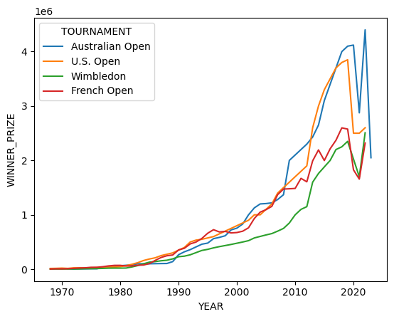

# Grand Slam Winners: An Exploratory Data Analysis (Project 2)

## Project Overview

This project is a deep dive into the world of professional tennis through Exploratory Data Analysis (EDA). Using a dataset of Grand Slam tournament winners, this analysis investigates historical trends, uncovers anomalies in the data, and tells a story about the evolution of prize money in tennis over the last 50 years.

The key focus of this project is not just analysis, but the critical process of **data cleaning and validation**. It demonstrates how to identify, investigate, and correct data quality issues to produce reliable and truthful insights.

## Technologies Used

*   Python
*   Pandas (for data manipulation, cleaning, and aggregation)
*   Seaborn & Matplotlib (for data visualization)
*   JupyterLab

## The Analytical Process

1.  **Initial Question:** The project started with a simple business question: "Who were the winners with the highest and lowest prize money?"

2.  **Data Exploration & Anomaly Detection:** An initial line plot of average prize money over the years revealed significant, illogical spikes and dips, particularly around the year 2000.

3.  **Investigation:** Through systematic filtering and analysis, it was discovered that the dataset contained **systematic data errors**: the prize money for the French Open was consistently and incorrectly recorded for several years.

4.  **Data Cleaning:** The erroneous data for the French Open was **programmatically excluded** from the dataset to remove the noise and reveal the true underlying trend.

5.  **Final Visualization & Insights:** A final, clean line plot was generated, comparing the prize money trends for the Australian Open, Wimbledon, and the U.S. Open.

## Key Insights

*   **Data Quality is Paramount:** The main takeaway is the critical importance of data cleaning. The initial "dirty" data told a misleading story, and only after rigorous cleaning did the true historical trend emerge.
*   **The Rise of Prize Money:** The final visualization clearly shows the exponential growth in tennis prize money, especially from the 1990s onwards, reflecting the sport's growing commercialization.
*   **Tournament Dynamics:** The cleaned data reveals the financial "race" between the U.S. Open and the Australian Open, with Wimbledon historically being more conservative with its prize funds.

### The Final, Cleaned Visualization

## How to Run
1.  Clone the repository.
2.  Ensure you have Python with pandas, seaborn, and matplotlib installed.
3.  Open `grand_slams_analysis.ipynb` in JupyterLab and run the cells.
